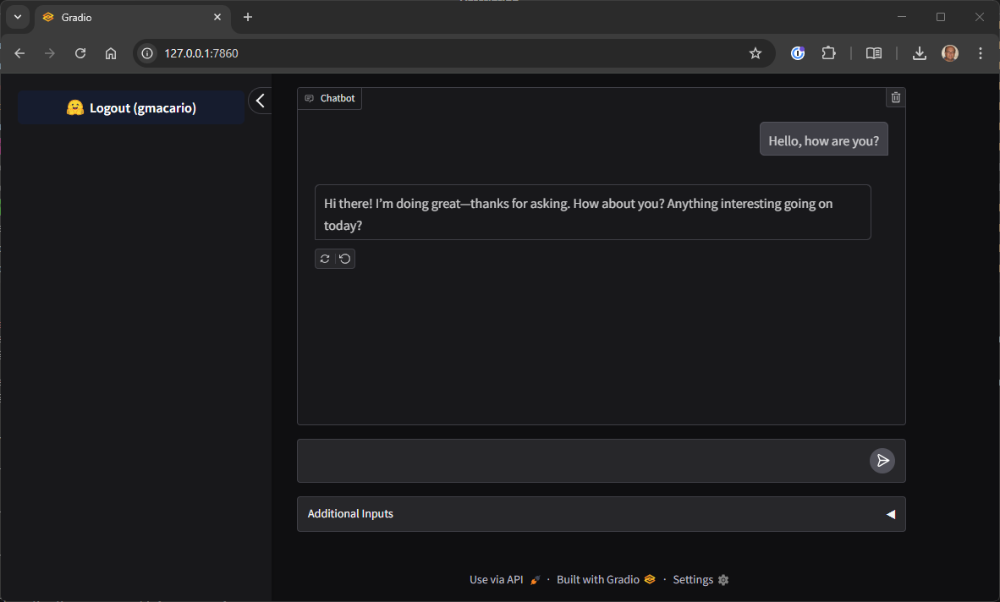

<!-- ## RUCHE -->


<!--  -->

Project **RUCHE** (acronym of **R**OS2-based **U**nified **C**ontrol for **H**ugging-face **E**mbodied-agents) is a project developed by the [B-AROL-O Team](https://github.com/B-AROL-O) in response to "[MCP'st 1st Birthday](https://huggingface.co/MCP-1st-Birthday)" Hackathon.
This Hackathon is hosted by [Anthropic](https://www.anthropic.com/) and [Gradio](https://www.gradio.app/) with additional support from [Hugging Face](https://huggingface.co/), [OpenAI](https://openai.com/), [Gemini](https://gemini.google.com/), [Modal](https://modal.com/), [Sambanova](https://sambanova.ai/), [ElevenLabs](https://elevenlabs.io/), [Blaxel](https://blaxel.ai/), [Llamaindex](https://www.llamaindex.ai/) and [Nebius](https://nebius.com/).

Incidentally, since [Ruché](https://en.wikipedia.org/wiki/Ruch%C3%A9) is a red [Italian wine](https://en.wikipedia.org/wiki/Italian_wine) [grape variety](https://en.wikipedia.org/wiki/Grape_variety) from the [Piedmont](<https://en.wikipedia.org/wiki/Piedmont_(wine)>) region, the name RUCHE was chosen to keep up with the naming convention of [B-AROL-O Team](https://github.com/B-AROL-O) Open Source projects, following [ARNEIS](https://github.com/B-AROL-O/ARNEIS), [FREISA](https://github.com/B-AROL-O/FREISA), etc.

<!-- TODO: Add a brief description of the project here. -->

<!-- From <https://huggingface.co/spaces/gradio-templates/chatbot>
An example chatbot using [Gradio](https://gradio.app), [`huggingface_hub`](https://huggingface.co/docs/huggingface_hub/v0.22.2/en/index), and the [Hugging Face Inference API](https://huggingface.co/docs/api-inference/index).
-->

## What the RUCHE project does

Here is a short video which explains what this project is able to do:

<!-- TODO: Update link as soon as @pitdagosti releases the video -->

[](https://www.youtube.com/watch?v=cWYLJE8ZgHk "RUCHE Video for MCP-1st-Birthday")

<!-- TODO: Add textual description -->

## RUCHE System Architecture

Here is a simplified block diagram which illustrates the main components of the RUCHE System Architecture and their interactions:


The following sections provide more details of the main blocks shown in the architecture diagram.

For simplicity the components are grouped in packages which represent where the components have been deployed during the MCP-1st-Birthday Hackathon.

However, most of the software components in the RUCHE architecture can run inside Docker Containers, therefore they may be relocated quite easily - for instance, they can be executed inside a [Dev Container](https://containers.dev/) and debugged using [Visual Studio Code](https://code.visualstudio.com/) as explained in chapter "How to run the RUCHE project".

### Package: Hugging Face Space

The core of the RUCHE application is `app.py`, a [Gradio 6](https://www.gradio.app/) application which can be deployed either inside a [Hugging Face Space](https://huggingface.co/spaces), or locally in a [Dev Container](https://containers.dev/) for development and test.

The main `app.py` implements a chatbot which acts as a main interface to the end-user.

The chatbot waits for user inputs, then performs the inference using a LLM ([Large Language Model](https://en.wikipedia.org/wiki/Large_language_model)) to analyze the user prompt and execute a suitable action in response.

In order to interact with the robots and provide more context to the LLM, `app.py` uses the tools exposed by `ros-mcp-server`, a dedicated [MCP server](https://modelcontextprotocol.io/) whose purpose is to expose to the LLM the topics provided by `ruche_ros2_control` - one of the [ROS 2 Jazzy](https://docs.ros.org/en/jazzy/index.html) nodes which are available inside the `ros2_pkg` package.

### Package: Hugging Face Hub

In its current implementation, the Large Language Model is provided by one [Inference Provider](https://huggingface.co/docs/inference-providers/) available through Hugging Face InferenceClient API.

This approach simplified a lot the deployment of the RUCHE application, which did not have to deal with installing and running the LLM locally.

Additionally, Hugging Face Hub provides an easy way for testing different LLMs - for the [MCP-1st-Birthday](https://huggingface.co/MCP-1st-Birthday) Hackathon we chose `gpt-oss-20b` released by [OpenAI](https://openai.com/) which the B-AROL-O team had already successfully used in the previous project [FREISA-GPT](https://github.com/B-AROL-O/FREISA). However, other more sophisticated models can easily be selected by means of a simple parameter change in the [`InferenceClient()`](https://huggingface.co/docs/huggingface_hub/en/package_reference/inference_client) constructor inside `app.py`.

### Package: ros2_pkg

This ROS 2 package uses a `ros2_control` controller to control either a simulated or a real robot for the RUCHE project.

We chose to adopt the standard [ros2_control](https://control.ros.org/jazzy/index.html) framework in order to be able to easily interface with other mainstream ROS 2 applications such as [Gazebo](https://gazebosim.org/), [RViz](https://wiki.ros.org/rviz), etc.

In its current implementation, RUCHE `ros2_pkg` consists of two ROS 2 nodes:

- The `ruche_ros2_control` node which may be configured to control either a simulated robot, or a physical one and exposes a unified interface.

- The `ros2_bt_bridge` has the purpose to translate ROS 2 topics and commands to simple messages which are broadcasted using the BLE ([Bluetooth Low Energy](https://en.wikipedia.org/wiki/Bluetooth_Low_Energy)) protocol.

In order to communicate with the BLE device, `ros2_bt_bridge` uses the Python [Bleak](https://bleak.readthedocs.io/) package which provides an abstraction of the BLE device on Windows, Linux and macOS.

### Package: Elegoo Smart Car Kit

For the sake of demonstrating the control of a physical robot, we chose the [Elegoo Smart Car Kit v3](https://eu.elegoo.com/en-it/blogs/arduino-projects/elegoo-smart-robot-car-kit-v3-0-plus-v3-0-v2-0-tutorial) - an inexpensive four-wheeled robot which is ideal for education. However, the architecture of RUCHE is quite flexible and may easily be adapted to more sophisticated and capable robots.

The BLE messages sent by `ros2_bt_bridge` are captured by the `BLE-to-UART` dongle and delivered to the [UART](https://en.wikipedia.org/wiki/Universal_asynchronous_receiver-transmitter) which is connected to the [Arduino UNO](https://www.arduino.cc/) installed on the robot.

An Arduino sketch running on the Arduino UNO is running the control loop which acts on the following inputs:

- Commands received from the UART
- Distance retrieved from the ultrasonic sensor

and provides the following output:

- Power to the four [DC Motors](https://docs.arduino.cc/learn/electronics/transistor-motor-control/) (rotation performed through differential drive)
- Position of the [Servo Motor](https://docs.arduino.cc/learn/electronics/servo-motors/) for rotating the ultrasonic sensor
- Send the updated robot state through the [UART](https://docs.arduino.cc/learn/communication/uart/)

## How to run the RUCHE project

### Inside the Hugging Face Space

The `main` branch of the RUCHE project is automatically synchronized to space <https://huggingface.co/spaces/MCP-1st-Birthday/RUCHE>, therefore to run the project you can simply open this URL inside a web browser

<!-- TODO: Add screenshot -->

- Click **Sign in with Hugging Face**, then enter your message and wait for the results

### Using GitHub Codespaces

You can use [GitHub Codespaces](https://github.com/features/codespaces) to create a Development Environment for the RUCHE project:

- From your browser open <https://github.com/B-AROL-O/RUCHE>
- Choose either the `main` (production) branch or other branches / Pull Requests you want to test
- Click the **\<\> Code** button, then in tab "Codespaces" click **+** to create a new codespace
- Open a bash Terminal and type:

  ```bash
  # Login to Gradio
  uv run hf auth login

  # Run the RUCHE chatbot app
  uv run app.py
  ```

  <!-- TODO: Add screenshot -->

- Continue as described in section "Inside the Hugging Face Space"

### Using Visual Studio Code

The RUCHE project can easily be run using a [Development Container](https://containers.dev/).

Prerequisites:

- A laptop or desktop PC running a recent version of Windows, macOS or Linux
- [Visual Studio Code](https://code.visualstudio.com/) with the following extensions: [Dev Containers](https://marketplace.visualstudio.com/items?itemName=ms-vscode-remote.remote-containers)
- A recent release of [Docker](https://www.docker.com/) (either [Docker Engine](https://docs.docker.com/engine/) or [Docker Desktop](https://www.docker.com/products/docker-desktop/))

Create a local Development Environment with the following steps:

- Launch Visual Studio
- Open the Command Palette and type:

  > Git: Clone

  then specify the repository: <https://github.com/B-AROL-O/RUCHE>

- Open the Command Palette and type:
  > Dev Containers: Rebuild and Reopen in Container
- Open a bash Terminal and type:

  ```bash
  # Login to Gradio
  uv run hf auth login

  # Run the RUCHE chatbot app
  uv run app.py
  ```

- Read the instructions displayed in the terminal and open the link in your browser

  

- Continue as described in section "Inside the Hugging Face Space"

## Tips for contributors

### Viewing and modifying Excalidraw diagrams

The RUCHE codebase contains a few `*.excalidraw.json` files, which are diagrams created using the [Excalidraw](https://excalidraw.com/) tool.

To view or modify the diagrams you have several options as detailed below.

#### Use the Excalidraw online tool

From your preferred browser, open <https://excalidraw.com/>, then click the "Hamburger" icon at the top left of the page and select the **Open** menu.

Locate the `*.excalidraw.json` file on your file system, or download it first. The diagram will then be displayed on your browser.

From Excalidraw you will then have several options, such as exporting the diagram as a `*.png` or `*.svg` file, modifying the diagram, saving the file after the diagram was modified, etc.

#### Use the Excalidraw Extension inside Visual Studio Code

If you are browsing the RUCHE codebase inside Visual Studio Code, make sure you have the [Excalidraw Extension](https://marketplace.visualstudio.com/items?itemName=pomdtr.excalidraw-editor) installed.

**NOTE**: The extension is already pre-installed in the RUCHE Dev Container.

Right click the file `*.excalidraw.json` > **Open With...**, then select the **Excalidraw** editor.

#### Use the Excalidraw Extension inside vscode.dev

If you are browsing the RUCHE codebase from <https://vscode.dev>, make sure you have the Visual Studio Code [Excalidraw Extension](https://marketplace.visualstudio.com/items?itemName=pomdtr.excalidraw-editor) installed.

Right click the file `*.excalidraw.json` > **Open With...**, then select the **Excalidraw** editor.

#### Additional help with Excalidraw

For more specific help about how to use Excalidraw, please refer to the documentation available at <https://docs.excalidraw.com/>.

### Knowing Super-Linter

The RUCHE project has strict code rules, which are enforced with [Super-Linter](https://github.com/super-linter/super-linter).

Super-Linter checks must pass before a Pull-Request can be reviewed and merged. That this might discourage some new contributors, but this is done to mitigate risks of conflicts and reduce the chances that buggy code will go straight to production.

If you run into troubles with Super-Linter when you push your feature branch or create a Pull Request, please refer to the Super-Linter documentation.

If you believe that some Super-Linter rules should be relaxed, consider adding a new a Super-Linter configuration rule or modifying an existing one:

- The Super-Linter workflow is stored under [`.github/workflows/linter.yml`](.github/workflows/linter.yml)
- The default configuration of all Super-Linter checkers can be inspected at <https://github.com/super-linter/super-linter/tree/main/TEMPLATES>
- The files which override the default configuration for each Super-Linter checker are stored under [.github/linters/](.github/linters/)

### Using Prettier

[Prettier](https://prettier.io/) is an opinionated Code Formatter which is able to check and verify the structure of source files in serveral formats, such as Markdown, Python and others. Most Super-Linter checks ensure that the code in the RUCHE codebase aligns with Prettier preferred formatting.

To verify that one or more files are in line with Super-Linter expectations you can run the following command:

```bash
prettier filename
```

If Prettier notices some misalignment you can easily reformat them before creating the Pull Request:

```bash
prettier -w filename
```

## The team behind RUCHE

| [Team Member](https://www.linkedin.com/)                                | [GitHub](https://github.com/)               | [Hugging Face](https://huggingface.co/)         |
| ----------------------------------------------------------------------- | ------------------------------------------- | ----------------------------------------------- |
| [Alessio Chessa](https://www.linkedin.com/in/alessiochessa/)            | [aleche28](https://github.com/aleche28)     | [aleche28](https://huggingface.co/aleche28)     |
| [Davide Macario](https://www.linkedin.com/in/davide-macario-b872b4225/) | [davmacario](https://github.com/davmacario) | [dmacario](https://huggingface.co/dmacario)     |
| [Gianpaolo Macario](https://www.linkedin.com/in/gmacario/)              | [gmacario](https://github.com/gmacario)     | [gmacario](https://github.com/gmacario)         |
| [Luigi Scalzone](https://www.linkedin.com/in/luigiscalzone/)            | [GGn0](https://github.com/GGn0)             | [GGn0](https://huggingface.co/GGn0)             |
| [Pietro D'Agostino](https://www.linkedin.com/in/pietro-d-agostino-phd/) | [pitdagosti](https://github.com/pitdagosti) | [pitdagosti](https://huggingface.co/pitdagosti) |

### How to stay in touch

You may follow [@baroloteam on Instagram](https://instagram.com/baroloteam) or [@baroloteam on X](https://x.com/baroloteam) to get notified about the progress of the RUCHE project.

Please report bugs and feature requests on <https://github.com/B-AROL-O/RUCHE/issues>, or DM [B-AROL-O Team on X](https://x.com/baroloteam) about security issues or other non-public topics.

## Copyright and License

Copyright (C) 2025, [B-AROL-O Team](https://github.com/B-AROL-O), all rights reserved.

**NOTE**: This repository is based upon <https://github.com/arol-polito/python-project-template>.

### Source code license

The source code contained in this repository and the executable distributions are licensed under the terms of the MIT license as detailed in the [LICENSE](LICENSE) file.

### Documentation license


Please note that your contribution to the project Documentation is licensed under a Creative Commons Attribution-Share Alike 4.0 License. see <https://creativecommons.org/licenses/by-sa/4.0/>

<!-- EOF -->
