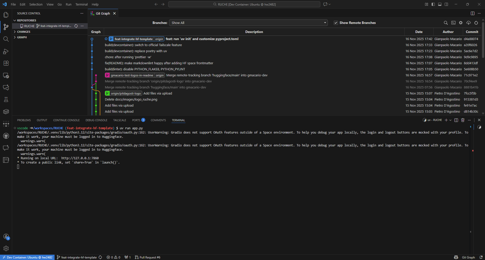

# HOWTO Run RUCHE chatbot in a Devcontainer

<!-- (2025-11-17 07:57 CET) -->

Logged in as `vscode@devcontainer` <!-- on <https://github.com/B-AROL-O/RUCHE/tree/feat-integrate-hf-template> -->
open a bash terminal and type the following command:

```bash
uv run hf auth login
```

Result:

```text
vscode ➜ /workspaces/RUCHE (feat-integrate-hf-template) $ uv run hf auth login

    _|    _|  _|    _|    _|_|_|    _|_|_|  _|_|_|  _|      _|    _|_|_|      _|_|_|_|    _|_|      _|_|_|  _|_|_|_|
    _|    _|  _|    _|  _|        _|          _|    _|_|    _|  _|            _|        _|    _|  _|        _|
    _|_|_|_|  _|    _|  _|  _|_|  _|  _|_|    _|    _|  _|  _|  _|  _|_|      _|_|_|    _|_|_|_|  _|        _|_|_|
    _|    _|  _|    _|  _|    _|  _|    _|    _|    _|    _|_|  _|    _|      _|        _|    _|  _|        _|
    _|    _|    _|_|      _|_|_|    _|_|_|  _|_|_|  _|      _|    _|_|_|      _|        _|    _|    _|_|_|  _|_|_|_|

    To log in, `huggingface_hub` requires a token generated from https://huggingface.co/settings/tokens .
Enter your token (input will not be visible):
```

Open <https://huggingface.co/settings/tokens/new?tokenType=write> and create a new Hugging Face Token.

Paste the value of the token which you have just created, then type ENTER.

Result:

```text
Enter your token (input will not be visible):
Add token as git credential? [y/N]: y
Token is valid (permission: write).
The token `RUCHE_devcontainer` has been saved to /home/vscode/.cache/huggingface/stored_tokens
Cannot authenticate through git-credential as no helper is defined on your machine.
You might have to re-authenticate when pushing to the Hugging Face Hub.
Run the following command in your terminal in case you want to set the 'store' credential helper as default.

git config --global credential.helper store

Read https://git-scm.com/book/en/v2/Git-Tools-Credential-Storage for more details.
Token has not been saved to git credential helper.
Your token has been saved to /home/vscode/.cache/huggingface/token
Login successful.
The current active token is: `RUCHE_devcontainer`
vscode ➜ /workspaces/RUCHE (feat-integrate-hf-template) $
```

<!-- (2025-11-17 08:15 CET) -->

```bash
uv run app.py
```

Result:



Follow the instructions and open <http://127.0.0.1:7860/>


In the chatbot main window click **Sign in with Hugging Face**.


Now type your messages into the chatbot - example:

> Hello, how are you?

After a few seconds you will get the following response:


<!--
Result:

```text
TODO
```

TODO
-->

<!-- EOF -->
